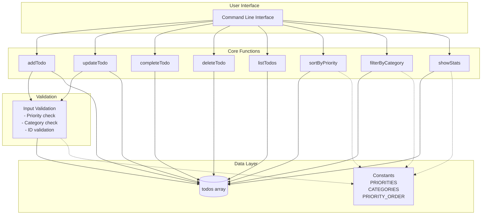
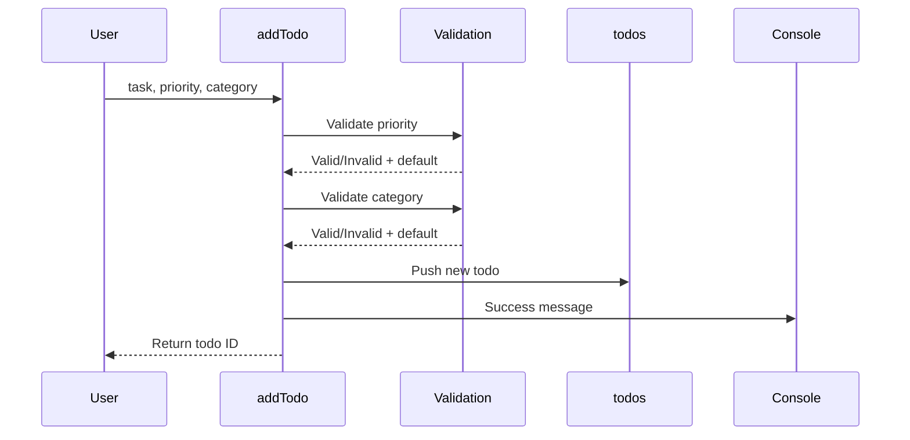
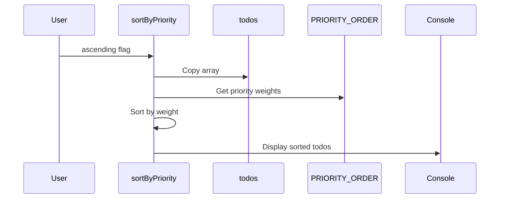
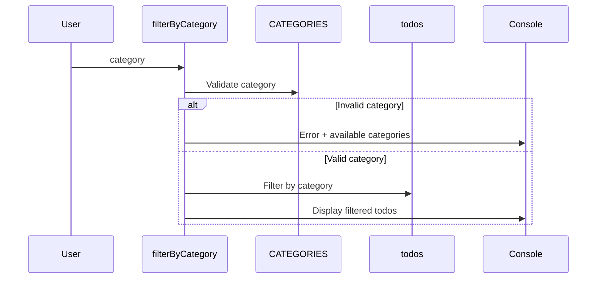

# Architecture Overview

## System Architecture



## Data Flow

### 1. Adding a Todo



### 2. Sorting by Priority



### 3. Filtering by Category



## Component Details

### Core Components

#### 1. Constants Module
```javascript
PRIORITIES = {
  HIGH: 'high',
  MEDIUM: 'medium',
  LOW: 'low'
}

CATEGORIES = {
  WORK: 'work',
  PERSONAL: 'personal',
  STUDY: 'study',
  SHOPPING: 'shopping'
}

PRIORITY_ORDER = {
  high: 3,
  medium: 2,
  low: 1
}
```

**Purpose:** Centralized configuration for priorities and categories
**Benefits:**
- Single source of truth
- Easy to modify
- Prevents typos
- Type safety through constants

#### 2. Data Storage
```javascript
const todos = [];
```

**Type:** Array of todo objects
**Structure:**
```javascript
{
  id: number,
  task: string,
  completed: boolean,
  priority: 'high' | 'medium' | 'low',
  category: 'work' | 'personal' | 'study' | 'shopping'
}
```

**Characteristics:**
- In-memory storage (no persistence)
- Mutable array for simplicity
- Unique timestamp-based IDs

#### 3. Function Categories

##### CRUD Operations
- `addTodo()` - Create
- `listTodos()` - Read
- `updateTodo()` - Update
- `deleteTodo()` - Delete
- `completeTodo()` - Update (specialized)

##### Query Operations
- `sortByPriority()` - Sort and display
- `filterByCategory()` - Filter and display
- `showStats()` - Aggregate and display

## Design Patterns

### 1. Functional Programming
- Pure functions where possible
- Immutable operations (e.g., sorting creates a copy)
- Single responsibility principle

### 2. Input Validation Pattern
```javascript
function addTodo(task, priority, category) {
  // Validate and default
  if (!Object.values(PRIORITIES).includes(priority)) {
    priority = PRIORITIES.MEDIUM;
  }
  // ... rest of function
}
```

**Benefits:**
- Prevents invalid data
- Provides helpful feedback
- Uses sensible defaults
- Fails gracefully

### 3. Display Formatting Pattern
```javascript
const status = todo.completed ? '✓' : ' ';
const priorityBadge = `[${todo.priority.toUpperCase()}]`;
const categoryBadge = `(${todo.category})`;
console.log(`${status} ${priorityBadge} ${todo.task} ${categoryBadge}`);
```

**Benefits:**
- Consistent output format
- Visual clarity
- Easy to read

## Error Handling Strategy

### 1. Validation at Entry Points
All user-facing functions validate inputs:
- Priority values
- Category values
- Todo IDs
- Update objects

### 2. Graceful Degradation
Instead of throwing errors:
- Use default values
- Display helpful messages
- Return success/failure status

### 3. User Feedback
Clear console messages for:
- Success operations
- Invalid inputs
- Empty results
- Available options

## Performance Considerations

### Current Implementation
- **Time Complexity:**
  - Add: O(1)
  - Update/Delete/Complete: O(n) - linear search
  - List: O(n)
  - Sort: O(n log n)
  - Filter: O(n)
  - Stats: O(n × categories × priorities)

- **Space Complexity:** O(n) where n = number of todos

### Optimization Opportunities
For larger datasets:
1. Use Map for O(1) lookups by ID
2. Maintain sorted indices
3. Cache statistics
4. Implement lazy evaluation

## Extension Points

### 1. Data Persistence Layer
```javascript
// Future: Add persistence adapter
class TodoStorage {
  save(todos) { /* JSON file or DB */ }
  load() { /* Read from storage */ }
}
```

### 2. Custom Categories
```javascript
// Future: Dynamic categories
const userCategories = new Set(['work', 'personal', ...]);
function addCategory(name) { /* ... */ }
```

### 3. Advanced Filtering
```javascript
// Future: Complex queries
function findTodos(criteria) {
  // Support: priority, category, completed, date range
}
```

### 4. Export/Import
```javascript
// Future: Data portability
function exportToJSON() { /* ... */ }
function importFromJSON(data) { /* ... */ }
function exportToMarkdown() { /* ... */ }
```

## Testing Strategy

### Unit Tests
Each function should have tests for:
- Happy path
- Edge cases (empty todos, invalid inputs)
- Boundary conditions
- Error handling

### Integration Tests
Test workflows:
- Add → List → Verify
- Add → Update → Verify
- Add → Filter → Verify count
- Add → Sort → Verify order

### Example Test Cases
```javascript
// addTodo validation
test('addTodo with invalid priority uses default', () => {
  const id = addTodo('Test', 'invalid', 'work');
  const todo = todos.find(t => t.id === id);
  expect(todo.priority).toBe('medium');
});

// sortByPriority correctness
test('sortByPriority orders high to low', () => {
  addTodo('Low task', 'low', 'work');
  addTodo('High task', 'high', 'work');
  const output = captureConsoleOutput(() => sortByPriority());
  expect(output.indexOf('High task')).toBeLessThan(output.indexOf('Low task'));
});
```

## Security Considerations

### Current Implementation
- No authentication (single-user CLI)
- No external inputs (controlled environment)
- No data persistence (no storage vulnerabilities)

### Future Considerations
If adding persistence or web interface:
- Input sanitization
- SQL injection prevention
- XSS protection
- Access control
- Data encryption

## Deployment

### Requirements
- Node.js >= 12
- No external dependencies (pure JavaScript)

### Installation
```bash
npm install todo-app-demo
# or
git clone && cd todo-app-demo && node index.js
```

### Configuration
Currently no configuration needed. Future:
- Config file for custom categories
- User preferences
- Storage location

## Maintenance

### Code Quality
- Clear function names
- Comprehensive comments
- Consistent formatting
- Single responsibility

### Documentation
- Inline JSDoc comments
- README with examples
- Design documentation
- Architecture diagrams

### Versioning
- Semantic versioning
- Changelog
- Migration guides for breaking changes
